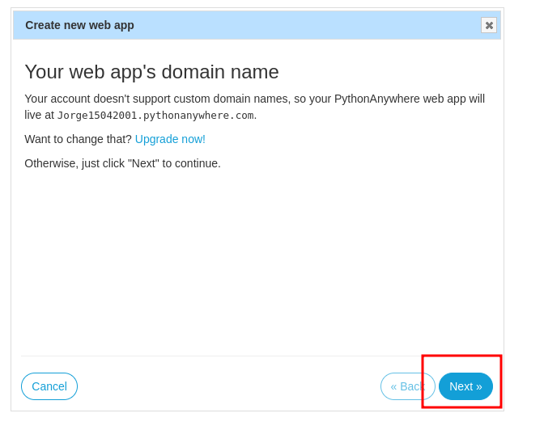
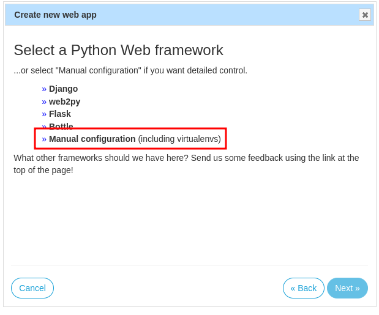
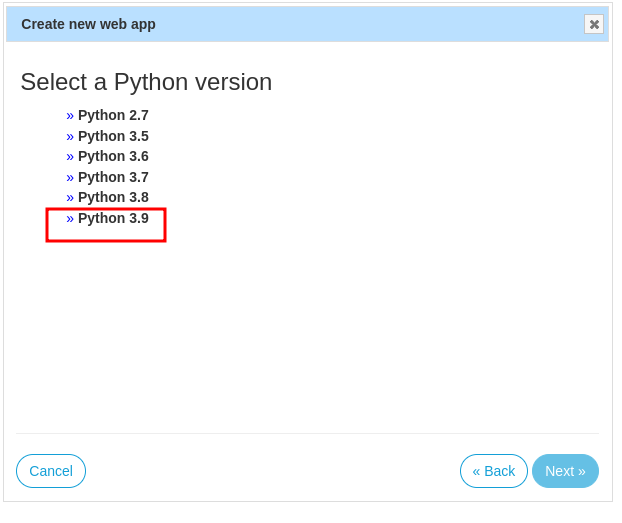
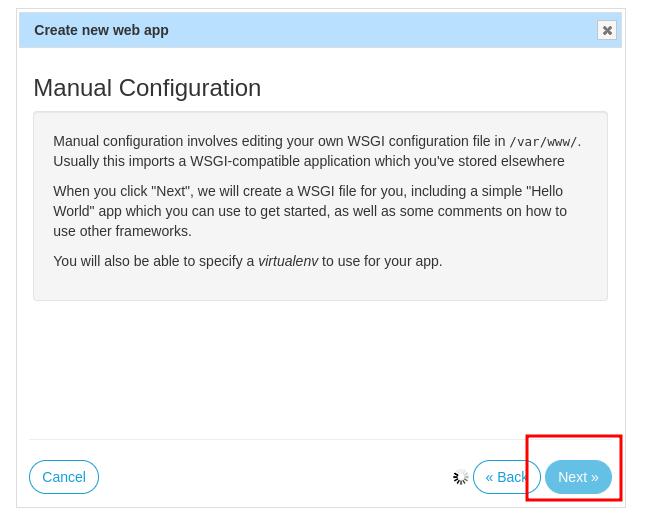
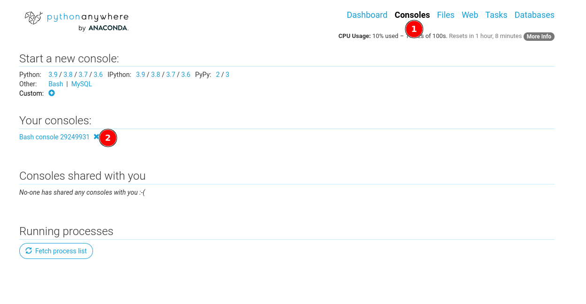
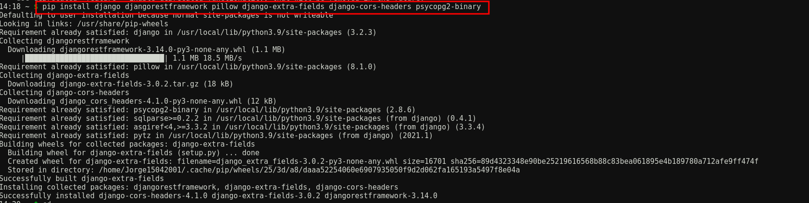

# Deployment on pythonanywhere

1. Create a new webapp

    


1. Select manual configuration

    

1. Select python version

    

1. Create the webapp

    

1. Enter console

    

1. Install dependencies

   ```bash
   pip install django djangorestframework pillow django-extra-fields django-cors-headers psycopg2-binary
   ```

    <!--  -->

1. clone the repository

   ```bash
   git clone https://github.com/Jorge15042001/PAOS_backend.git
   ```


